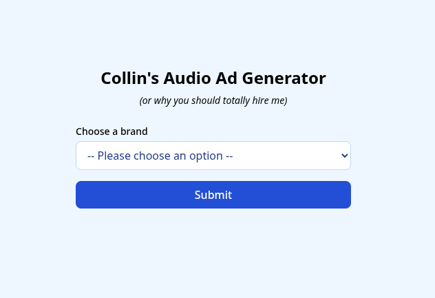

# Collin's Audio Ad Generator

A simple fastapi python project capable of producing an audio ad including voiceover and music playable on a frontend from a selection of 3 business brands provided.

## What is this exactly?

This is for a take home assessment for certain advertising company in Kansas City. Not for production use.

## How do I run this?

### Prerequisites

1. Have [Docker installed](https://docs.docker.com/engine/install/)
2. An API key for OpenAI
3. An API key for ElevenLabs


### Steps to get it running

1. Clone the repo
2. Create a .env file with `OPENAI_API_KEY` and `ELEVEN_LABS_KEY` variables at the root of the project. Example:

```
OPENAI_API_KEY=<KEY>
ELEVEN_LABS_KEY=<KEY>
```

3. Run Docker build from the root of the project:

```
docker build -t audioad .
```

4. Run Docker run from the root of the project and don't forget to pass in the .env from step 2:

```
docker run --env-file .env -p 80:80 audioad
```

5. Go to http://localhost in your browser and be amazed



